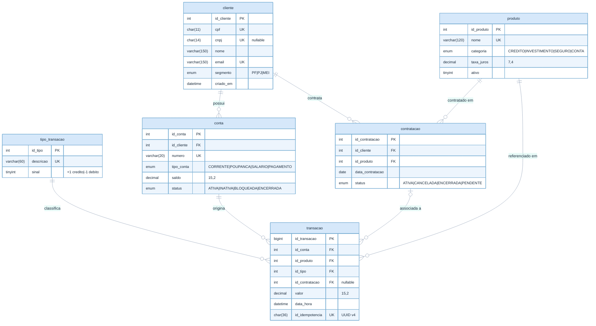

```mermaid
%%{init: {"theme": "base", "themeVariables": {
  "primaryColor":        "#D6E8FA",
  "primaryTextColor":    "#1a2b3c",
  "primaryBorderColor":  "#7BAFD4",
  "lineColor":           "#94A3B8",
  "secondaryColor":      "#FDE8D0",
  "tertiaryColor":       "#D1F5F0",
  "edgeLabelBackground": "#F8FAFC",
  "fontFamily":          "monospace",
  "fontSize":            "13px"
}}}%%
erDiagram

    cliente {
        int         id_cliente    PK
        char(11)    cpf           UK
        char(14)    cnpj          UK "nullable"
        varchar(150) nome
        varchar(150) email        UK
        enum        segmento      "PF|PJ|MEI"
        datetime    criado_em
    }

    produto {
        int         id_produto    PK
        varchar(120) nome         UK
        enum        categoria     "CREDITO|INVESTIMENTO|SEGURO|CONTA"
        decimal     taxa_juros    "7,4"
        tinyint     ativo
    }

    tipo_transacao {
        int         id_tipo       PK
        varchar(60) descricao     UK
        tinyint     sinal         "+1 credito|-1 debito"
    }

    conta {
        int         id_conta      PK
        int         id_cliente    FK
        varchar(20) numero        UK
        enum        tipo_conta    "CORRENTE|POUPANCA|SALARIO|PAGAMENTO"
        decimal     saldo         "15,2"
        enum        status        "ATIVA|INATIVA|BLOQUEADA|ENCERRADA"
    }

    contratacao {
        int         id_contratacao   PK
        int         id_cliente       FK
        int         id_produto       FK
        date        data_contratacao
        enum        status           "ATIVA|CANCELADA|ENCERRADA|PENDENTE"
    }

    transacao {
        bigint      id_transacao     PK
        int         id_conta         FK
        int         id_produto       FK
        int         id_tipo          FK
        int         id_contratacao   FK "nullable"
        decimal     valor            "15,2"
        datetime    data_hora
        char(36)    id_idempotencia  UK "UUID v4"
    }

    cliente      ||--o{ conta          : "possui"
    cliente      ||--o{ contratacao    : "contrata"
    produto      ||--o{ contratacao    : "contratado em"
    produto      ||--o{ transacao      : "referenciado em"
    conta        ||--o{ transacao      : "origina"
    tipo_transacao ||--o{ transacao    : "classifica"
    contratacao  |o--o{ transacao      : "associada a"
```
