## Modelo Relacional (MySQL)

## Modelo Cassandra (CQL — query-first)

> Sem JOIN, sem FK, sem AUTO_INCREMENT. Os dados são **desnormalizados**: uma
> tabela por padrão de acesso. `PK` = *partition key*, `CK` = *clustering column*.
> Linhas tracejadas indicam cópias denormalizadas da mesma entidade lógica.

```mermaid
%%{init: {"theme": "base", "themeVariables": {
  "primaryColor":        "#D1F5F0",
  "primaryTextColor":    "#1a2b3c",
  "primaryBorderColor":  "#5EBDB0",
  "lineColor":           "#94A3B8",
  "secondaryColor":      "#FDE8D0",
  "tertiaryColor":       "#D6E8FA",
  "edgeLabelBackground": "#F8FAFC",
  "fontFamily":          "monospace",
  "fontSize":            "13px"
}}}%%
erDiagram

    cliente_by_id {
        uuid      id_cliente PK
        text      cpf
        text      cnpj
        text      nome
        text      email
        text      segmento
        timestamp criado_em
    }
    cliente_by_cpf {
        text cpf        PK
        uuid id_cliente
        text nome
        text email
        text segmento
    }
    cliente_by_email {
        text email      PK
        uuid id_cliente
        text nome
        text cpf
    }

    produto_by_id {
        uuid    id_produto PK
        text    nome
        text    categoria
        decimal taxa_juros
        boolean ativo
    }
    produto_by_categoria {
        text    categoria  PK
        text    nome "CK"
        uuid    id_produto
        decimal taxa_juros
        boolean ativo
    }

    tipo_transacao {
        uuid    id_tipo   PK
        text    descricao
        tinyint sinal
    }

    conta_by_cliente {
        uuid    id_cliente PK
        uuid    id_conta "CK"
        text    numero
        text    tipo_conta
        decimal saldo
        text    status
    }
    conta_by_numero {
        text    numero     PK
        uuid    id_conta
        uuid    id_cliente
        text    tipo_conta
        decimal saldo
        text    status
    }

    contratacao_by_cliente {
        uuid id_cliente       PK
        date data_contratacao "CK"
        uuid id_produto "CK"
        uuid id_contratacao
        text status
    }
    contratacao_by_produto {
        uuid id_produto       PK
        date data_contratacao "CK"
        uuid id_cliente "CK"
        uuid id_contratacao
        text status
    }

    transacao_by_conta {
        uuid      id_conta        PK
        timestamp data_hora "CK"
        timeuuid  id_transacao "CK"
        uuid      id_produto
        uuid      id_tipo
        uuid      id_contratacao
        decimal   valor
        text      id_idempotencia
    }
    transacao_by_idempotencia {
        text      id_idempotencia PK
        timeuuid  id_transacao
        uuid      id_conta
        decimal   valor
        timestamp data_hora
    }
    transacao_by_produto {
        uuid      id_produto   PK
        timestamp data_hora "CK"
        timeuuid  id_transacao "CK"
        uuid      id_conta
        uuid      id_tipo
        decimal   valor
    }

    cliente_by_id          ||..|| cliente_by_cpf             : "denormaliza"
    cliente_by_id          ||..|| cliente_by_email           : "denormaliza"
    produto_by_id          ||..|| produto_by_categoria       : "denormaliza"
    conta_by_cliente       ||..|| conta_by_numero            : "denormaliza"
    contratacao_by_cliente ||..|| contratacao_by_produto     : "denormaliza"
    transacao_by_conta     ||..|| transacao_by_idempotencia  : "denormaliza"
    transacao_by_conta     ||..|| transacao_by_produto       : "denormaliza"
```

### De relacional para colunar

| Tabela relacional | Tabela(s) Cassandra | Padrão de acesso |
|---|---|---|
| `cliente` | `cliente_by_id`, `cliente_by_cpf`, `cliente_by_email` | busca por id e por chaves únicas |
| `produto` | `produto_by_id`, `produto_by_categoria` | por id e listagem por categoria |
| `tipo_transacao` | `tipo_transacao` | tabela de lookup |
| `conta` (1:N) | `conta_by_cliente`, `conta_by_numero` | contas de um cliente / por número |
| `contratacao` (N:N) | `contratacao_by_cliente`, `contratacao_by_produto` | as duas direções do N:N |
| `transacao` | `transacao_by_conta`, `transacao_by_idempotencia`, `transacao_by_produto` | extrato (série temporal), dedup, analítico |
